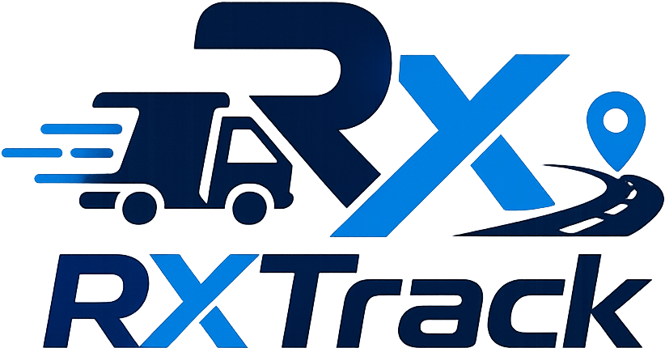

<div align="center">
  
</div>

# Atualizações Aplicadas (Push para Produção)

**Data:** 08/06/2026
**Hora:** 10:10

## O que foi alterado nesta versão:

Abaixo estão listadas as atualizações passadas do projeto principal (`nv`) para o repositório de produção:

1. **Integração com TMS (ESL):**
   - Corrigida a task `finalizar_manifesto_tms_task` (`backend/manifesto/tasks.py`) para enviar o *mutation GraphQL* completo exigido pela documentação da ESL na finalização do manifesto.
   - Removido o campo `closingKm` que estava causando falhas na comunicação com a ESL.
   - Ajustada a listagem de notas, filtrando corretamente pelo `numero_visual` do manifesto.

2. **Fluxo Operacional de Manifestos:**
   - Atualizada a view `salvar_edicao_manifesto_view` (`backend/operacional/views.py`) para disparar a task de integração do TMS em background (via Celery) no exato momento em que o manifesto é marcado como "finalizado" no painel.

3. **Banco de Dados (Mobile):**
   - O campo `endpoint` do modelo `WebPushSubscription` (`backend/mobile/models.py`) foi convertido de `TextField` para `URLField(max_length=500)`, visando maior segurança e adequação dos dados.

4. **Frontend e PWA (Aplicativo Mobile):**
   - Atualização das imagens e ícones do PWA (`icon-160x160.png`, `icon-512x512.png`).
   - Correção do redirecionamento do Service Worker e dos scripts Javascript. A rota de autenticação foi mantida em `/login/` (`backend/static/js/manifesto_v17.js` e `backend/static/js/serviceworker.js`).

---
> **Aviso de Infraestrutura:** Os arquivos de configuração de ambiente (`docker-compose.yml`, `.env`, `Dockerfile`) **não** foram sobrescritos. A porta principal do projeto foi preservada como **8000**, para garantir que o ambiente de produção permaneça separado do ambiente VPS de testes.

<br>

**Data:** 08/06/2026
**Hora:** 15:45

## Adendos e Correções Pós-Migração:

1. **Atualização da Identidade Visual PWA:**
   - Ícones atualizados para o modelo oficial de fundo branco validado pelo cliente, com a versão do Service Worker forçada para atualização em cache.

2. **Ajustes de Layout Responsivo (Painel Operacional):**
   - Corrigido o bug onde a barra lateral ficava presa na tela (Mobile). Agora ela possui barra de rolagem inteligente (escondendo a barra nativa do navegador no Desktop) e se fecha automaticamente ao clicar na área externa da tela.

3. **Notificações do Aplicativo:**
   - Suspenso o alerta de permissão para notificações WebPush no aplicativo do motorista (agora ele loga diretamente, sem janelas chatas). Preparação para futura integração de notificações com WhatsApp.

4. **Painel de Gestão de Usuários (Controle de Acesso):**
   - Correção de validação hierárquica no backend (`usuarios/gestao_views.py`) que bloqueava perfis do tipo `GESTOR` de editar ou excluir permissões de outros Gestores (ou deles mesmos). Agora Gestores possuem passe-livre, enquanto Gerentes continuam com a trava.

---

**Data:** 08/06/2026
**Hora:** 17:30

## Arquitetura PWA Duplo (Motorista e SAC):

Foi realizado um **rollback total** nas tentativas anteriores de unificar as rotas do SAC e Motorista sob o mesmo Service Worker, pois a lógica de interceptação estava prejudicando o cache offline necessário para o motorista em áreas sem internet.

Para resolver o problema definitivamente, o sistema foi dividido em dois PWA instaláveis independentes:

1. **PWA do Motorista (Original):**
   - **Acesso:** `/login/` -> `/app/`
   - **Comportamento:** Mantém o Cache Offline-First agressivo. Nenhuma alteração foi mantida.
2. **PWA do SAC (Novo):**
   - **Acesso Exclusivo:** Nova rota `/login-sac/` redirecionando para `/app-sac/`.
   - **PWA Isolado:** Criados `manifest_sac.json` e `serviceworker_sac.js`.
   - **Comportamento do Cache:** Estratégia "Network-First", garantindo que a equipe do SAC sempre veja a versão mais recente em tempo real (já que operam com internet estável), eliminando o bug de roteamento corrompido ao fechar o app.
   - **Identidade Visual:** Adicionados novos ícones (`icon-sac-160x160.png` e `icon-sac-512x512.png`) com badge "SAC" personalizado, permitindo que os gestores identifiquem facilmente qual aplicativo está instalado na tela inicial do celular.

### Correções (Bugfixes) Posteriores
1. **Erro 500 no Daphne (Backend):** Corrigida falha de inicialização do servidor provocada pela ausência de importação dos decorators `@api_view`, `@permission_classes` e `@authentication_classes` no arquivo `usuarios/views_login/auth_views.py`.
2. **Conflito de Instalação de App (Frontend):** Removida a tag nativa `` da tela de login clonada do SAC. Essa tag injetava dinamicamente o `/manifest.json` do motorista, induzindo o navegador a instalar o PWA incorreto. A tag foi substituída por uma referência explícita estática ao `<link rel="manifest" href="/app-sac/manifest_sac.json">`.
3. **Redirecionamento de Logout:** Criação do script customizado `authFetch_sac.js` para garantir que sessões expiradas no SAC redirecionem o usuário de volta para `/login-sac/` em vez de `/login/`.

---

**Data:** 09/06/2026
**Hora:** 14:45

## Multitenancy, Isolamento de Dados e Refinamentos de UI:

1. **Isolamento de Dados por Filial (Multi-Tenancy):**
   - Implementado isolamento rigoroso nas QuerySets do sistema inteiro.
   - As views de **Dashboard, Torre de Controle, Notas e Manifestos** agora filtram as informações com base na `Filial` vinculada ao manifesto.
   - As views de **Auditoria e Performance** filtram os dados olhando para a `Filial` do Motorista.
   - Lógica de Prioridade definida: Parâmetros de URL (ex: `?filial=`) sobrepõem a filial do perfil do usuário. Caso o usuário não tenha filial e não aplique filtros, nenhuma informação sensível é carregada.
   - Adicionado banner de alerta (amarelo) global no `base.html` que notifica usuários que estão acessando o painel mas ainda não possuem vínculo com nenhuma filial.

2. **Cadastro e Edição de Motoristas:**
   - Adicionado o campo `telefone` (Celular com DDD) ao modelo de `Motorista` no banco de dados para preparar terreno para futuras automações via WhatsApp.
   - Modais de criação e edição agora possuem input para "Telefone" (com máscara JS embutida) e campo de seleção Dropdown para vincular/alterar a "Filial" do motorista de forma dinâmica.

3. **Criação Automática de Filiais com ID do TMS:**
   - Atualizada a `buscar_manifesto_completo_task` (`backend/manifesto/tasks.py`) para consumir os campos `mft_crn_id` e `mft_crn_psn_nickname` do payload JSON da ESL.
   - Quando o sistema consulta a ESL e encontra uma filial nova, ele a cria automaticamente no banco já preenchendo o `id_filial_tms`. Se a filial já existe e o ID está vazio (como em cadastros manuais antigos), ele detecta e preenche o ID por baixo dos panos.

4. **UX e Correções na Interface (Bugfixes):**
   - Substituída a imagem quebrada (`empty-truck.svg`) na Torre de Controle por um ícone SVG nativo do Bootstrap responsivo para o cenário sem resultados.
   - Corrigido o Erro 500 no modal de detalhes da Auditoria de Processos que travava a visualização da nota (resolvido injetando fallback seguro na variável `badgeColor` no JS).
   - Menu "Financeiro" removido permanentemente da barra lateral.
   - Cabeçalho da barra lateral modificado: Substituído texto cru pela logo oficial do app (`logo_app.png`) acompanhada de uma tag destacando a filial ativa do usuário logado na sessão atual.
   - **UX de Finalização (Mobile):** Reduzido drasticamente o tempo de recarregamento (`setTimeout`) ao finalizar um manifesto de 3000ms para 500ms no PWA do motorista. Isso evita a falsa sensação de travamento e o recarregamento assíncrono que gerava a mensagem de "Manifesto já finalizado" quando o motorista fechava o app antes do tempo de animação.

---

> [!IMPORTANT]
> **ANÁLISE ARQUITETURAL E DIRETRIZES FUTURAS (PROJETO MULTI-SAAS):**
> 
> Durante a etapa de refinamento e isolamento de dados do dia 09/06/2026, foi realizada uma avaliação técnica crítica quanto à expansão do sistema para o modelo **Multi-Tenant SaaS** (múltiplas empresas no mesmo painel com isolamento via subdomínios).
> 
> A conclusão estabelecida foi de que o atual banco de dados **MySQL não possui suporte nativo à separação por schemas lógicos** da maneira como a arquitetura moderna do Django (ex: biblioteca `django-tenants`) exige para realizar o roteamento seguro e escalável. 
> 
> Sendo assim, **é mandatório que a infraestrutura realize a migração dos dados do MySQL para um banco de dados PostgreSQL** (versão 13 ou superior) antes que a transição para Multi-SaaS seja implementada. A tentativa de forçar o modelo Multi-SaaS no MySQL ("Row-level Multi-tenancy") exigiria a reescrita maciça de todas as QuerySets do sistema, adicionando chaves estrangeiras de `empresa_id` em todos os modelos (altíssimo custo de engenharia e altíssimo risco de vazamento de dados). O PostgreSQL resolverá este desafio "por baixo dos panos" garantindo segurança, escalabilidade e menor necessidade de reescrita do código fonte.

---

**Data:** 11/06/2026
**Hora:** 11:30

## Atualizações Aplicadas (10/06 a 11/06):

1. **Migração Oficial Concluída (MySQL para PostgreSQL):**
   - Transição definitiva e bem-sucedida do MySQL para o PostgreSQL na infraestrutura da VPS, cumprindo o pré-requisito arquitetural para o futuro modelo Multi-SaaS.
   - Atualização do `backend/core/settings.py` para usar dinamicamente a engine e opções do PostgreSQL a partir das variáveis de ambiente (`.env`).
   - Reestruturação do script `entrypoint.sh` do Docker para monitorar a disponibilidade do PostgreSQL (utilizando `psycopg2`) antes de disparar o Django, prevenindo falhas de inicialização do Nginx (Erro 404).

2. **Novos Módulos Dinâmicos (Painel Operacional):**
   - **Central de Treinamentos:** Nova página implementada e integrada dinamicamente. Os administradores agora cadastram vídeos pelo Django Admin, que são renderizados em modais dinâmicos no portal com suporte a rastreamento de engajamento (likes e visualizações de vídeos por usuário).
   - **Central de Ajuda (Suporte):** O painel de tickets de suporte foi dinamizado, garantindo o acompanhamento visual do status do chamado e restringindo a criação excessiva de tickets baseada em lógicas do perfil de usuário.

3. **Correções de Permissões (SAC):**
   - Resolvido um bug crítico que causava bloqueio indevido de usuários com nível de "Gestor" no painel do SAC. A checagem de cargos no backend foi priorizada e corrigida (`09ed582`).

4. **Direitos Autorais e Licenciamento (Legal):**
   - Criação e inclusão de uma licença de software proprietário (`LICENSE`) na raiz do repositório para proteção jurídica do código fonte.
   - Injeção de cabeçalhos formais de Copyright nos arquivos vitais e de configuração do backend.

5. **Ajustes de Timezone, E-mails e Central de Ajuda:**
   - **Gestão de Usuários e Automação de E-mails:** Adicionadas as colunas de **E-mail** e **Último Acesso** na tabela principal de Gestão de Usuários. Inserido um novo botão de ação rápida (ícone de envelope) para disparar **E-mails de Redefinição de Senha**. Corrigido o envio de **E-mails de Boas Vindas** e **Convite SAC**, alterando o remetente padrão para evitar bloqueios de *spoofing*.
   - **Correção Definitiva de Timezone:** Restaurada a integridade global mantendo `USE_TZ = True`. Corrigido o bug da virada de dia antecipada às 21h no painel `DashboardView` e exibição do **Último Acesso** na listagem de usuários.
   - **Correção de Erro na Central de Ajuda:** Resolvido o *Erro 500* que derrubava a renderização devido a uma falha de referência (importação) do modelo `TicketSuporte`.

---

**Data:** 15/06/2026
**Hora:** 11:30

## Transição Oficial para Multi-SaaS (Multi-Tenant):

Concluímos a migração arquitetural do sistema para o modelo **Multi-SaaS** com isolamento por schemas no PostgreSQL utilizando a biblioteca `django-tenants`. A partir desta versão, o sistema pode hospedar de forma isolada múltiplos clientes com seus próprios subdomínios (ex: `cliente1.quicktrack.com.br`), compartilhando a mesma base de código.

### Detalhes das Alterações:
1. **Isolamento via Schemas (PostgreSQL):**
   - O banco de dados agora roda sob a engine `'django_tenants.postgresql_backend'`.
   - Separação de rotas e tabelas: `SHARED_APPS` (tabelas de gerenciamento global localizadas no schema `public`) e `TENANT_APPS` (tabelas operacionais de cada cliente em schemas separados).
2. **Central de Tutoriais/Treinamento Compartilhada:**
   - O modelo `VideoTreinamento` foi extraído para o novo app público `tutoriais`, assegurando que os vídeos criados fiquem armazenados apenas no schema `public`. Dessa forma, todas as empresas clientes do SaaS podem compartilhar a mesma lista de tutoriais sem replicação de dados.
3. **Página Inicial Pública:**
   - Criado o arquivo `core/urls_public.py` contendo uma página de entrada elegante e responsiva (design premium baseado em CSS vanilla, fuso escuro e tipografia moderna), instruindo os usuários a utilizarem o subdomínio correspondente à sua empresa.

---

## 🚀 Guia de Implantação e Migração de Dados na VPS (Homolog/Produção)

Para aplicar essa nova versão na sua VPS (onde você já possui motoristas e manifestos cadastrados no ambiente `homolog.quicktrack.com.br`) **sem perder nenhum dado operacional**, você deve seguir o seguinte protocolo de banco de dados:

### 1. Fazer Backup do Banco Atual
Sempre inicie fazendo um backup preventivo completo:
```bash
pg_dump -U seu_usuario -h seu_host -d quicktrack_homolog > backup_antes_tenant.sql
```

### 2. Renomear o Schema Original no PostgreSQL
No PostgreSQL, todo o seu banco atual de homologação está localizado no schema padrão `public`. Execute no Postgres para renomear e criar um novo público:
```sql
-- Renomeia o schema completo (preserva todas as tabelas e dados)
ALTER SCHEMA public RENAME TO homolog;

-- Cria um novo schema public em branco para as tabelas globais do Django
CREATE SCHEMA public;
```

### 3. Deploy do Novo Código e Migração Global (Shared)
Suba a nova versão do código para a VPS e rode as migrações que criam as tabelas de controle de clientes no novo schema público:
```bash
python manage.py migrate_schemas --shared
```

### 4. Registrar o Tenant "Homolog" no Banco de Dados
Para conectar o Django ao schema renomeado `homolog`, abra o Django Shell na VPS:
```bash
python manage.py shell
```
E cadastre o cliente associando-o ao schema e subdomínio corretos:
```python
from tenants.models import Client, Domain

# Registra o cliente apontando para o schema que renomeamos no passo 2
tenant = Client(schema_name='homolog', name='QuickTrack Homolog')
tenant.save()

# Associa o subdomínio atual dos motoristas ao tenant
domain = Domain(domain='homolog.quicktrack.com.br', tenant=tenant, is_primary=True)
domain.save()
```
*Como o schema `homolog` já possui todas as tabelas e motoristas criados antes da migração, a associação é instantânea e segura.*

### 5. Aplicar Novas Migrações nos Tenants
Execute as migrações gerais de tenant para que o novo app de `tutoriais` e alterações adicionais sejam aplicados em todos os schemas:
```bash
python manage.py migrate_schemas --tenant
```

---

**Data:** 16/06/2026
**Hora:** 15:35

## Correção Crítica: Celery + Multi-SaaS (Tenant-Aware Workers)

Após a transição para a arquitetura Multi-SaaS, foi detectado um bug crítico que impedia a sincronização de manifestos via Celery. Os workers do Celery não possuíam consciência do contexto de tenant, fazendo com que todas as tasks fossem executadas no schema `public` ao invés do schema do cliente correto.

### Sintoma Identificado
```
ERROR: relation "manifesto_manifestobuscalog" does not exist
UnboundLocalError: cannot access local variable 'log' where it is not associated with a value
```
O Celery procurava as tabelas operacionais no schema `public` (onde elas não existem), pois o worker não sabia para qual cliente (tenant) a task havia sido disparada.

### Solução Aplicada
1. **Nova dependência:** Adicionada a biblioteca `tenant-schemas-celery~=2.1.0` ao `requirements.txt`.
2. **Atualização do `core/celery.py`:** Substituída a classe padrão `Celery` pela classe `TenantAwareCelery` (importada de `tenant_schemas_celery.app`). Essa classe injeta automaticamente o `schema_name` do tenant atual em cada task disparada, e ao executar a task, o worker alterna para o schema correto antes de acessar o banco de dados.

### Deploy na VPS (Rebuild obrigatório)
Como uma nova biblioteca foi adicionada, é necessário reconstruir a imagem Docker:
```bash
docker-compose down
docker-compose build
docker-compose up -d
```

---

**Data:** 19/06/2026  
**Hora:** 10:25  

## Arquitetura Multi-TMS e Mapeamento Dinâmico de Ocorrências:

1. **Camada de Adapters e Registry (Multi-TMS):**
   - Criado o novo app `integracoes/` para centralizar a comunicação com diferentes sistemas de TMS.
   - Definido o contrato [BaseTMSAdapter](file:///c:/Users/Micro/Desktop/nv/nv/quicktrack_producao_repo/backend/integracoes/base.py) e a fábrica [registry.py](file:///c:/Users/Micro/Desktop/nv/nv/quicktrack_producao_repo/backend/integracoes/registry.py).
   - Isolada 100% da lógica legada específica da ESL Cloud dentro do [ESLCloudAdapter](file:///c:/Users/Micro/Desktop/nv/nv/quicktrack_producao_repo/backend/integracoes/providers/esl_cloud.py).
   - Preservados os nomes e assinaturas originais de todas as Celery tasks em [tasks.py](file:///c:/Users/Micro/Desktop/nv/nv/quicktrack_producao_repo/backend/manifesto/tasks.py) (ex: `enviar_baixa_esl_task`), mantendo a compatibilidade 100% retroativa com o app mobile e telas operacionais.

2. **Novas Configurações por Tenant/Schema:**
   - Adicionados os campos `tms_provider` (Provedor TMS) e `tms_config` (JSON de configurações dinâmicas) ao modelo `ConfiguracaoSistema` em [models.py](file:///c:/Users/Micro/Desktop/nv/nv/quicktrack_producao_repo/backend/configuracao/models.py).
   - Seção **🔗 Provedor TMS** adicionada ao Django Admin de cada cliente, permitindo trocar o sistema TMS (ex: ESL Cloud, Brudam, TOTVS, ou Sem Integração) sem mexer em código.

3. **Mapeamento de Ocorrências no Painel Admin:**
   - Adicionado o campo `codigo_referencia` no modelo `Ocorrencia` em [models.py](file:///c:/Users/Micro/Desktop/nv/nv/quicktrack_producao_repo/backend/manifesto/models.py).
   - O gestor pode associar as ocorrências do seu próprio TMS (sejam strings como `"entregue"`, `"recusado"` ou números como `'25'`) às referências padronizadas do aplicativo (como `'01'` para Entrega e `'02'` para Recusa).
   - Atualizada a view de recebimento de baixas [baixa.py](file:///c:/Users/Micro/Desktop/nv/nv/quicktrack_producao_repo/backend/manifesto/rotas/baixa.py) e o validador [serializers.py](file:///c:/Users/Micro/Desktop/nv/nv/quicktrack_producao_repo/backend/manifesto/serializers.py) para buscar primeiro pelo mapeamento de referência (`codigo_referencia`), com fallback para o código do TMS antigo se não configurado.

4. **Banco de Dados e Dependências:**
   - Geradas migrações de banco no app `configuracao` e `manifesto`.
   - Ajustadas as dependências no ambiente virtual da VPS de modo a assegurar total estabilidade dos pacotes de segurança (`cryptography` e `pyopenssl`).

---

**Data:** 30/06/2026
**Hora:** 17:15

## Exclusão de Notas Fiscais Pendentes (Painel Operacional):

1. **Nova Rota de Exclusão de NF-e (`DELETE`):**
   - Criada a view `deletar_nota_fiscal_view` em [views.py](file:///c:/Users/Micro/Desktop/nv/nv/quicktrack_producao_repo/backend/operacional/views.py) com proteção por `@login_required`, `@apenas_operacional` e `@require_POST`.
   - Registrada a rota `api/nota-fiscal/deletar/<nota_id>/` em [urls.py](file:///c:/Users/Micro/Desktop/nv/nv/quicktrack_producao_repo/backend/operacional/urls.py).

2. **Regra de Negócio (Segurança):**
   - A exclusão é permitida **exclusivamente** para notas com status `PENDENTE`.
   - Notas com status `BAIXADA` ou `OCORRENCIA` são bloqueadas pelo backend (retorno HTTP 403), independentemente de qualquer tentativa via interface ou API direta.
   - No Django Admin, a exclusão de qualquer nota continua liberada normalmente para administradores.

3. **Interface (Frontend):**
   - Adicionado botão de exclusão (ícone lixeira vermelha) na coluna de ações da tabela de NF-e em [notas_fiscais.html](file:///c:/Users/Micro/Desktop/nv/nv/quicktrack_producao_repo/backend/templates/desktop/paginas/notas_fiscais.html), visível apenas ao lado de notas pendentes.
   - Modal de confirmação com feedback visual (loading, sucesso e erro), seguindo o mesmo padrão de UX dos modais de sincronização TMS já existentes.

